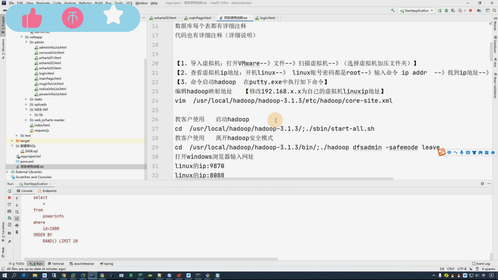

## 计算机毕业设计Hadoop+Hive居民用电量分析 居民用电量可视化 电量爬虫 机器学习 深度学习 大数据毕业设计 Spark

## 要求
### 源码有偿！一套(论文 PPT 源码+sql脚本+教程)

### 
### 加好友前帮忙start一下，并备注github有偿Hadoop用电分析
### 我的QQ号是2827724252或者798059319或者 1679232425或者微信:bysj2023nb 或bysj1688

# 

### 加qq好友说明（被部分 网友整得心力交瘁）：
    1.加好友务必按照格式备注
    2.避免浪费各自的时间！
    3.当“客服”不容易，repo 主是体面人，不爆粗，性格好，文明人。

### 功能	
基于Hadoop的用户电量可视化平台，需要使用Hadoop+hive+spark+hdfs大数据技术，
提供数据集，源码，远程搭建运行服务，数据集2075259条数据，大屏可视化，动态分析。	

### 演示视频
https://www.bilibili.com/video/BV1Lf421i77Q/?spm_id_from=333.999.0.0

### 截图

